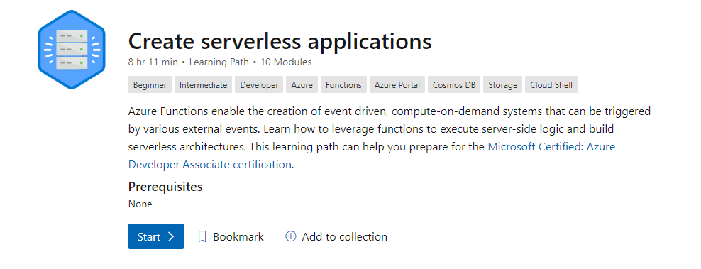
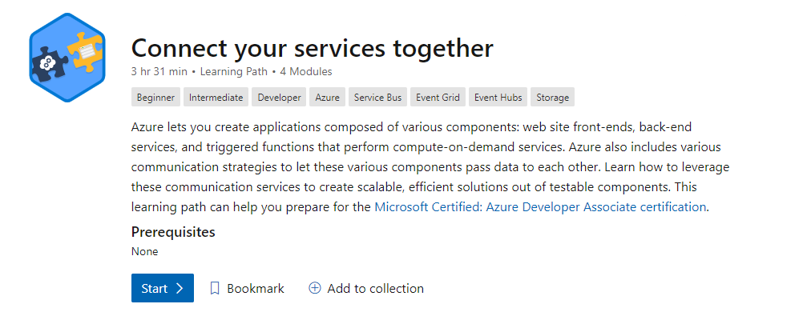
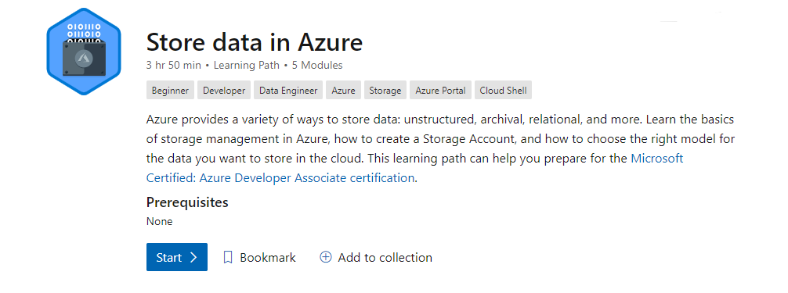
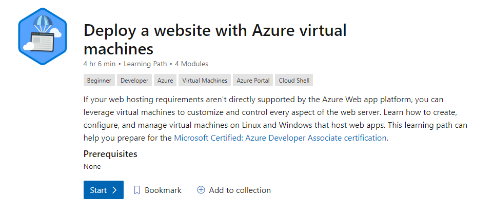
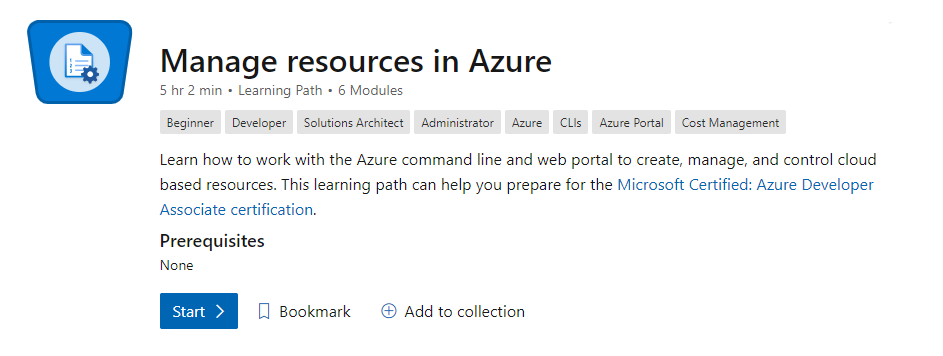
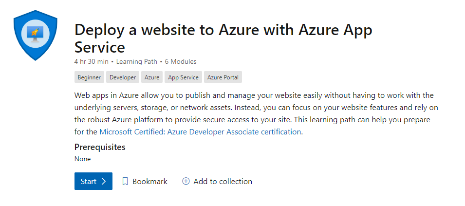
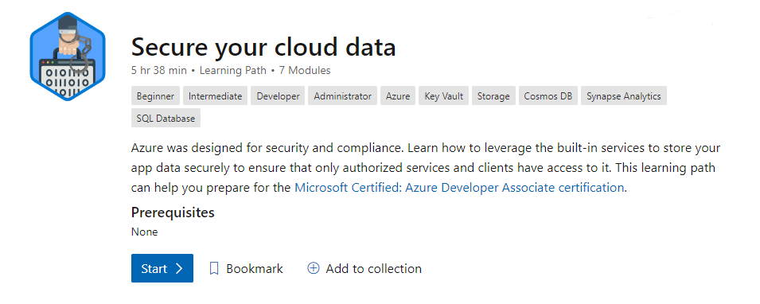

### What is the AZ-204?

The AZ-204 is an exam that shows a canidates undertstanding the subject matter of designing, building, testing, and maintaining cloud applications and services on Microsoft Azure.

Upon passing the certification you will be seen as an Azure Developer.

### What does an Azure Developer Do?

An Azure Developer participates in all phases of cloud development from requirements definition and design, to development, deployment, and maintenance. performance tuning, and monitoring.

### What skills are needed to become an Azure Developer?

I have added Microsoft learn and official documentation on how to achive the skills needed to pass the exam.

#### Microsoft Learn

##### Create serverless applications

[Link to module](https://docs.microsoft.com/en-us/learn/paths/create-serverless-applications/)

##### Connect your services together

[Link to module](https://docs.microsoft.com/en-us/learn/paths/connect-your-services-together/)

##### Store data in Azure

[Link to module](https://docs.microsoft.com/en-us/learn/paths/store-data-in-azure/)

##### Deploy a website with Azure virtual Machines

[Link to module](https://docs.microsoft.com/en-us/learn/paths/deploy-a-website-with-azure-virtual-machines/)

##### Manage resources in Azure

[Link to module](https://docs.microsoft.com/en-us/learn/paths/manage-resources-in-azure/)

##### Deploy a website to Azure with Azure App Service

[Link to module](https://docs.microsoft.com/en-us/learn/paths/deploy-a-website-with-azure-app-service/)

##### Secure your cloud data

[Link to module](https://docs.microsoft.com/en-us/learn/paths/secure-your-cloud-data/)

#### Develop Azure compute solutions (25-30%)

##### Implement IaaS solutions

* ###### provision VMs

    [Quickstart: Create a Windows virtual machine in the Azure portal](https://docs.microsoft.com/en-us/azure/virtual-machines/windows/quick-create-portal)

    [Tutorial: Create and Manage Windows VMs with Azure PowerShell](https://docs.microsoft.com/en-us/azure/virtual-machines/windows/tutorial-manage-vm)

* ######    configure VMs for remote access

    [Connect to your Azure-based virtual machine](https://docs.microsoft.com/en-us/azure/virtual-machines/windows/connect-logon)

    [Secure your management ports with just-in-time access](https://docs.microsoft.com/en-us/azure/security-center/security-center-just-in-time?tabs=jit-config-asc%2Cjit-request-asc)

* ######    create ARM templates

    [Extend Azure Resource Manager template functionality](https://docs.microsoft.com/en-us/azure/architecture/building-blocks/extending-templates/)

    [Azure Resource Manager templates overview](https://docs.microsoft.com/en-us/azure/azure-resource-manager/templates/overview)

    [Tutorial: Create and deploy your first Azure Resource Manager template](https://docs.microsoft.com/en-us/azure/azure-resource-manager/templates/template-tutorial-create-first-template&tabs=azure-powershell)

* ######    create container images for solutions by using Docker

    [Tutorial: Build and deploy container images in the cloud with Azure Container Registry Tasks](https://docs.microsoft.com/en-us/azure/container-registry/container-registry-tutorial-quick-task)
    
    [Tutorial: Create container images on a Linux Service Fabric cluster](https://docs.microsoft.com/en-us/azure/service-fabric/service-fabric-tutorial-create-container-images)

    [Tutorial: Create a container image for deployment to Azure Container Instances](https://docs.microsoft.com/en-us/azure/container-instances/container-instances-tutorial-prepare-app)

    [Build and store container images with Azure Container Registry (Microsoft Learn)](https://docs.microsoft.com/en-us/learn/modules/build-and-store-container-images/)

* ######    publish an image to the Azure Container Registry

    [Push your first image to a private Docker container registry using the Docker CLI](https://docs.microsoft.com/en-us/azure/container-registry/container-registry-get-started-docker-cli)

* ######    run containers by using Azure Container Instance

    [Run Docker containers with Azure Container Instances (Microsoft Learn)](https://docs.microsoft.com/en-us/learn/modules/run-docker-with-azure-container-instances/)

    [What is Azure Container Instances?](https://docs.microsoft.com/en-us/azure/container-instances/container-instances-overview)

    [Quickstart: Deploy a container instance in Azure using the Azure CLI](https://docs.microsoft.com/en-us/azure/container-instances/container-instances-quickstart)

    [Quickstart: Deploy a container instance in Azure using the Azure portal](https://docs.microsoft.com/en-us/azure/container-instances/container-instances-quickstart-portal)
    
    [Quickstart: Deploy a container instance in Azure using Azure PowerShell](https://docs.microsoft.com/en-us/azure/container-instances/container-instances-quickstart-powershell)

    [Tutorial: Deploy a container application to Azure Container Instances](https://docs.microsoft.com/en-us/azure/container-instances/container-instances-tutorial-deploy-app)

##### Create Azure App Service Web Apps

* ######    create an Azure App Service Web App

    [Create an ASP.NET Core web app in Azure](https://docs.microsoft.com/en-us/azure/app-service/quickstart-dotnetcore&pivots=platform-linux)

* ######    enable diagnostics logging

    [Enable diagnostics logging for apps in Azure App Service](https://docs.microsoft.com/en-us/azure/app-service/troubleshoot-diagnostic-logs)

    [Capture Web Application Logs with App Service Diagnostics Logging (Microsoft Learn)](https://docs.microsoft.com/en-us/learn/modules/capture-application-logs-app-service/)

* ######    deploy code to a web app

    [Deploy your app to Azure App Service with a ZIP or WAR file](https://docs.microsoft.com/en-us/azure/app-service/deploy-zip)

    [Deploy an Azure Web App](https://docs.microsoft.com/en-us/azure/devops/pipelines/targets/webapp&view=azure-devops&tabs=yaml)

    [Provision and deploy microservices predictably in Azure](https://docs.microsoft.com/en-us/azure/app-service/deploy-complex-application-predictably)

* ######    configure web app settings including SSL, API, and connection strings

    [Custom configuration and application settings in Azure Web Sites](https://azure.microsoft.com/en-us/resources/videos/configuration-and-app-settings-of-azure-web-sites/)

    [Configure an App Service app in the Azure portal](https://docs.microsoft.com/en-us/azure/app-service/configure-common)

    [Buy a custom domain name for Azure App Service](https://docs.microsoft.com/en-us/azure/app-service/manage-custom-dns-buy-domain)

    [Add a TLS/SSL certificate in Azure App Service](https://docs.microsoft.com/en-us/azure/app-service/configure-ssl-certificate)

* ######    implement autoscaling rules, including scheduled autoscaling, and scaling by operational or system metrics

    [Scale up an app in Azure App Service](https://docs.microsoft.com/en-us/azure/app-service/manage-scale-up)

    [Get started with Autoscale in Azure](https://docs.microsoft.com/en-us/azure/azure-monitor/platform/autoscale-get-started)

##### Implement Azure functions

* ######    implement input and output bindings for a function

    [Azure Functions triggers and bindings concepts](https://docs.microsoft.com/en-us/azure/azure-functions/functions-triggers-bindings&tabs=csharp)

    [Azure Functions trigger and binding example](https://docs.microsoft.com/en-us/azure/azure-functions/functions-bindings-example)

* ######    implement function triggers by using data operations, timers, and webhooks

    [Azure Functions triggers and bindings concepts](https://docs.microsoft.com/en-us/azure/azure-functions/functions-triggers-bindings&tabs=csharp)

    [Azure Functions trigger and binding example](https://docs.microsoft.com/en-us/azure/azure-functions/functions-bindings-example)

    [Azure Functions HTTP triggers and bindings overview](https://docs.microsoft.com/en-us/azure/azure-functions/functions-bindings-http-webhook)

* ######    implement Azure Durable Functions

    [What are Durable Functions?](https://docs.microsoft.com/en-us/azure/azure-functions/durable/durable-functions-overview&tabs=csharp)

    [Create your first durable function in C#](https://docs.microsoft.com/en-us/azure/azure-functions/durable/durable-functions-create-first-csharp&pivots=code-editor-vscode)

#### Develop for Azure storage (10-15%)

##### Develop solutions that use Cosmos DB storage

* ######    select the appropriate API for your solution

    [Choose the appropriate API for Azure Cosmos DB storage (Microsoft Learn)](https://docs.microsoft.com/en-us/learn/modules/choose-api-for-cosmos-db/)

    [Welcome to Azure Cosmos DB](https://docs.microsoft.com/en-us/azure/cosmos-db/introduction)

* ######    implement partitioning schemes

    [Partitioning in Azure Cosmos DB](https://docs.microsoft.com/en-us/azure/cosmos-db/partitioning-overview)

* ######    interact with data using the appropriate SDK

    [Tutorial: Develop an ASP.NET Core MVC web application with Azure Cosmos DB by using .NET SDK](https://docs.microsoft.com/en-us/azure/cosmos-db/sql-api-dotnet-application)

    [Tutorial: Build a .NET console app to manage data in Azure Cosmos DB SQL API account](https://docs.microsoft.com/en-us/azure/cosmos-db/sql-api-get-started)

    [Tutorial: Query Azure Cosmos DB by using the SQL API](https://docs.microsoft.com/en-us/azure/cosmos-db/tutorial-query-sql-api)

    [Tutorial: Set up Azure Cosmos DB global distribution using the SQL API](https://docs.microsoft.com/en-us/azure/cosmos-db/tutorial-global-distribution-sql-api&tabs=dotnetv2%2Capi-async)

* ######    set the appropriate consistency level for operations

    [Choose the right consistency level](https://docs.microsoft.com/en-us/azure/cosmos-db/consistency-levels)

    [Consistency levels and Azure Cosmos DB APIs](https://docs.microsoft.com/en-us/azure/cosmos-db/consistency-levels)

    [Consistency, availability, and performance tradeoffs](https://docs.microsoft.com/en-us/azure/cosmos-db/consistency-levels)

* ######    create Cosmos DB containers

    [Create an Azure Cosmos container](https://docs.microsoft.com/en-us/azure/cosmos-db/how-to-create-container)

* ######    implement scaling (partitions, containers)

    [Partitioning and horizontal scaling in Azure Cosmos DB](https://docs.microsoft.com/en-us/azure/cosmos-db/partitioning-overview)

    [Work with databases, containers, and items in Azure Cosmos DB](https://docs.microsoft.com/en-us/azure/cosmos-db/account-databases-containers-items)

* ######    implement server-side programming including stored procedures, triggers, and change feed notifications

    [Stored Procedures](https://docs.microsoft.com/en-us/rest/api/cosmos-db/stored-procedures)

    [Triggers](https://docs.microsoft.com/en-us/rest/api/cosmos-db/triggers)

    [Change feed in Azure Cosmos DB](https://docs.microsoft.com/en-us/azure/cosmos-db/change-feed)

##### Develop solutions that use blob storage

* ######  move items in Blob storage between storage accounts or containers

    [Copy and move blobs from one container or storage account to another from the command line and in code (Microsoft Learn)](https://docs.microsoft.com/en-us/learn/modules/copy-blobs-from-command-line-and-code/)

    [Transfer data with AzCopy and Blob storage](https://docs.microsoft.com/en-us/azure/storage/common/storage-use-azcopy-blobs)

    [Using the Azure CLI with Azure Storage](https://docs.microsoft.com/en-us/azure/storage/blobs/storage-quickstart-blobs-cli)

* ######    set and retrieve properties and metadata

    [Manage container properties and metadata with .NET](https://docs.microsoft.com/en-us/azure/storage/blobs/storage-blob-container-properties-metadata&tabs=dotnet)

* ######    interact with data using the appropriate SDK

    [Quickstart: Azure Blob storage client library v12 for .NET](https://docs.microsoft.com/en-us/azure/storage/blobs/storage-quickstart-blobs-dotnet)

* ######    implement data archiving and retention

    [Store business-critical blob data with immutable storage](https://docs.microsoft.com/en-us/azure/storage/blobs/storage-blob-immutable-storage)

    [Azure Blob storage: hot, cool, and archive access tiers](https://docs.microsoft.com/en-us/azure/storage/blobs/storage-blob-storage-tiers&tabs=azure-portal)

    [Rehydrate blob data from the archive tier](https://docs.microsoft.com/en-us/azure/storage/blobs/storage-blob-rehydration&tabs=azure-portal)

* ######    implement hot, cool, and archive storage
    [Azure Blob storage: hot, cool, and archive access tiers](https://docs.microsoft.com/en-us/azure/storage/blobs/storage-blob-storage-tiers&tabs=azure-portal)

#### Implement Azure security (15-20%)

##### Implement user authentication and authorization

* ######    implement OAuth2 authentication

    [Protect an API by using OAuth 2.0 with Azure Active Directory and API Management](https://docs.microsoft.com/en-us/azure/api-management/api-management-howto-protect-backend-with-aad)

    [Authentication basics](https://docs.microsoft.com/en-us/azure/active-directory/develop/authentication-vs-authorization)

* ######    create and implement shared access signatures

    [Grant limited access to Azure Storage resources using shared access signatures (SAS)](https://docs.microsoft.com/en-us/azure/storage/common/storage-sas-overview)

* ######    register apps and use Azure Active Directory to authenticate users

    [Develop line-of-business apps for Azure Active Directory](https://docs.microsoft.com/en-us/azure/active-directory/manage-apps/developer-guidance-for-integrating-applications)

* ######    control access to resources by using role-based access controls (RBAC)

    [What is Azure role-based access control (Azure RBAC)?](https://docs.microsoft.com/en-us/azure/role-based-access-control/overview)

    [Classic subscription administrator roles, Azure roles, and Azure AD roles](https://docs.microsoft.com/en-us/azure/role-based-access-control/rbac-and-directory-admin-roles)

##### Implement secure cloud solutions

* ######    secure app configuration data by using the App Configuration and KeyVault API

    [Securely save secret application settings for a web application](https://docs.microsoft.com/en-us/previous-versions/azure/key-vault/vs-secure-secret-appsettings)

    [Use Key Vault references for App Service and Azure Functions](https://docs.microsoft.com/en-us/azure/app-service/app-service-key-vault-references)

    [What is Azure App Configuration?](https://docs.microsoft.com/en-us/azure/azure-app-configuration/overview)

* ######    manage keys, secrets, and certificates by using the KeyVault API

    [About keys, secrets, and certificates](https://docs.microsoft.com/en-us/azure/key-vault/general/about-keys-secrets-certificates)

    [Configure and manage secrets in Azure Key Vault (Microsoft Learn)](https://docs.microsoft.com/en-us/learn/modules/configure-and-manage-azure-key-vault/)

* ######    implement Managed Identities for Azure resources

    [What are managed identities for Azure resources?](https://docs.microsoft.com/en-us/azure/active-directory/managed-identities-azure-resources/overview)

    [Tutorial: Use a user-assigned managed identity on a Windows VM to access Azure Resource Manager](https://docs.microsoft.com/en-us/azure/active-directory/managed-identities-azure-resources/tutorial-windows-vm-ua-arm)

#### Monitor, troubleshoot, and optimize Azure solutions (10-15%)

##### Integrate caching and content delivery within solutions

* ######    develop code to implement CDNs in solutions

    [Azure CDN Documentation](https://docs.microsoft.com/en-us/azure/cdn/)

    [Best practices for using content delivery networks (CDNs)](https://docs.microsoft.com/en-us/azure/architecture/best-practices/cdn)

    [Create an Azure CDN endpoint](https://docs.microsoft.com/en-us/azure/cdn/cdn-create-endpoint-how-to)

    [What is Azure Front Door?](https://docs.microsoft.com/en-us/azure/frontdoor/front-door-overview)

    [Azure Cache for Redis](https://docs.microsoft.com/en-us/azure/azure-cache-for-redis/cache-overview)

* ######    configure cache and expiration policies for FrontDoor, CDNs, or Redis caches Store and retrieve data in Azure Redis cache

    [Control Azure CDN caching behavior with caching rules](https://docs.microsoft.com/en-us/azure/cdn/cdn-caching-rules)

    [Caching with Azure Front Door](https://docs.microsoft.com/en-us/azure/frontdoor/front-door-caching)

    [Quickstart: Create an Azure Cache for Redis instance](https://docs.microsoft.com/en-us/azure/azure-cache-for-redis/quickstart-create-redis)

    [Best practices for Azure Cache for Redis](https://docs.microsoft.com/en-us/azure/azure-cache-for-redis/cache-best-practices)

    [Quickstart: Use Azure Cache for Redis with a .NET Framework application](https://docs.microsoft.com/en-us/azure/azure-cache-for-redis/cache-dotnet-how-to-use-azure-redis-cache)

    [Caching](https://docs.microsoft.com/en-us/azure/architecture/best-practices/caching)

##### Instrument solutions to support monitoring and logging

* ######    configure instrumentation in an app or service by using Application Insights

    [Application Insights for ASP.NET Core applications](https://docs.microsoft.com/en-us/azure/azure-monitor/app/asp-net-core)

    [Quickstart: Start monitoring your website with Azure Monitor Application Insights](https://docs.microsoft.com/en-us/azure/azure-monitor/app/website-monitoring)

* ######    analyze log data and troubleshoot solutions by using Azure Monitor

    [Monitoring solutions in Azure Monitor](https://docs.microsoft.com/en-us/azure/azure-monitor/insights/solutions&tabs=portal)

    [Logs in Azure Monitor](https://docs.microsoft.com/en-us/azure/azure-monitor/platform/data-platform-logs)

    [Find and diagnose run-time exceptions with Azure Application Insights](https://docs.microsoft.com/en-us/azure/azure-monitor/learn/tutorial-runtime-exceptions)

    [Find and diagnose performance issues with Azure Application Insights](https://docs.microsoft.com/en-us/azure/azure-monitor/learn/tutorial-performance)

* ######    implement Application Insights Web Test and Alerts

    [Creating an Application Insights Web Test and Alert Programmatically](https://azure.microsoft.com/en-us/blog/creating-a-web-test-alert-programmatically-with-application-insights/)

    [Monitor the availability of any website](https://docs.microsoft.com/en-us/azure/azure-monitor/app/monitor-web-app-availability)

#### Connect to and consume Azure services and third-party services (25-30%)

##### Develop an App Service Logic App

* ######    create a Logic App

    [Quickstart: Create your first workflow by using Azure Logic Apps – Azure portal](https://docs.microsoft.com/en-us/azure/logic-apps/quickstart-create-first-logic-app-workflow)

    [Quickstart: Create automated tasks, processes, and workflows with Azure Logic Apps – Visual Studio](https://docs.microsoft.com/en-us/azure/logic-apps/quickstart-create-logic-apps-with-visual-studio)

    [Quickstart: Create and manage logic app workflow definitions by using Visual Studio Code](https://docs.microsoft.com/en-us/azure/logic-apps/quickstart-create-logic-apps-visual-studio-code)

* ######    create a custom connector for Logic Apps

    [Create a custom connector in Azure Logic Apps](https://docs.microsoft.com/en-us/connectors/custom-connectors/create-logic-apps-connector)

    [B2B enterprise integration solutions with Azure Logic Apps and Enterprise Integration Pack](https://docs.microsoft.com/en-us/azure/logic-apps/logic-apps-enterprise-integration-overview)

* ######    create a custom template for Logic Apps

    [Create Azure Resource Manager templates to automate deployment for Azure Logic Apps](https://docs.microsoft.com/en-us/azure/logic-apps/logic-apps-create-azure-resource-manager-templates)

    [Create logic app workflows from prebuilt templates](https://docs.microsoft.com/en-us/azure/logic-apps/logic-apps-create-logic-apps-from-templates)

##### Implement API Management

* ######    create an APIM instance

    [Create a new Azure API Management service instance](https://docs.microsoft.com/en-us/azure/api-management/get-started-create-service-instance)

* ######    configure authentication for APIs

    [How to secure APIs using client certificate authentication in API Management](https://docs.microsoft.com/en-us/azure/api-management/api-management-howto-mutual-certificates-for-clients)

* ######    define policies for APIs

    [Policies in Azure API Management](https://docs.microsoft.com/en-us/azure/api-management/api-management-howto-policies)

    [API Management policies](https://docs.microsoft.com/en-us/azure/api-management/api-management-policies)

##### Develop event-based solutions

* ######    implement solutions that use Azure Event Grid

    [What is Azure Event Grid?](https://docs.microsoft.com/en-us/azure/event-grid/overview)

    [Event-Driven Architecture in the Cloud with Azure Event Grid](https://docs.microsoft.com/en-us/archive/msdn-magazine/2018/february/azure-event-driven-architecture-in-the-cloud-with-azure-event-grid)

    [Quickstart: Route custom events to web endpoint with the Azure portal and Event Grid](https://docs.microsoft.com/en-us/azure/event-grid/custom-event-quickstart-portal)

    [Tutorial: Monitor virtual machine changes by using Azure Event Grid and Logic Apps](https://docs.microsoft.com/en-us/azure/event-grid/monitor-virtual-machine-changes-event-grid-logic-app)

* ######    implement solutions that use Azure Notification Hubs

    [What is Azure Notification Hubs?](https://docs.microsoft.com/en-us/azure/notification-hubs/notification-hubs-push-notification-overview)

    [Integration with App Service Mobile Apps](https://docs.microsoft.com/en-us/azure/notification-hubs/notification-hubs-app-service)

    [Create an Azure notification hub in the Azure portal](https://docs.microsoft.com/en-us/azure/notification-hubs/create-notification-hub-portal)

* ######    implement solutions that use Azure Event Hub

    [Features and terminology in Azure Event Hubs](https://docs.microsoft.com/en-us/azure/event-hubs/event-hubs-features)

    [Quickstart: Create an event hub using Azure portal](https://docs.microsoft.com/en-us/azure/event-hubs/event-hubs-create)

    [Tutorial: Stream data into Azure Databricks using Event Hubs](https://docs.microsoft.com/en-us/azure/databricks/scenarios/databricks-stream-from-eventhubs)

##### Develop message-based solutions

* ######    implement solutions that use Azure Service Bus

    [What is Azure Service Bus?](https://docs.microsoft.com/en-us/azure/service-bus-messaging/service-bus-messaging-overview)

    [Quickstart: Use Azure portal to create a Service Bus queue](https://docs.microsoft.com/en-us/azure/service-bus-messaging/service-bus-quickstart-portal)

    [Get started with Service Bus queues](https://docs.microsoft.com/en-us/azure/service-bus-messaging/service-bus-dotnet-get-started-with-queues)

* ######    implement solutions that use Azure Queue Storage queues

    [What are Azure queues?](https://docs.microsoft.com/en-us/azure/storage/queues/storage-queues-introduction)

    [Get started with Azure Queue storage using .NET](https://docs.microsoft.com/en-us/azure/storage/queues/storage-dotnet-how-to-use-queues&tabs=dotnet)