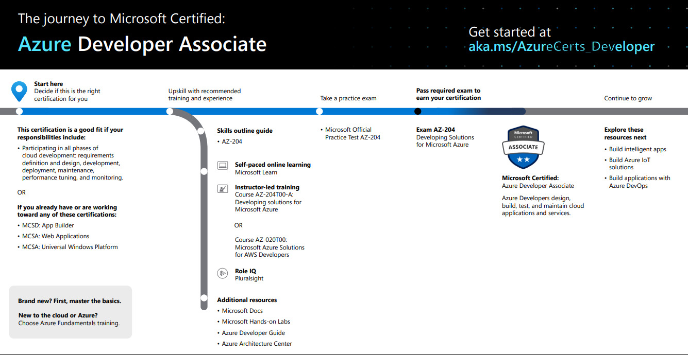

# Introduction
Azure Developers design and build cloud solutions such as applications and services. They participate in all phases of development, from solution design, to development and deployment, to testing and maintenance. They partner with cloud solution architects, cloud DBAs, cloud administrators, and clients to implement the solution.

They should be proficient in developing apps and services by using Azure tools and technologies, including storage, security, compute, communications and at least one cloud-supported programming language.

# What skills are measured
- Develop Azure compute solutions (25-30%)
- Develop for Azure storage (10-15%)
- Implement Azure security (15-20%)
- Monitor, troubleshoot, and optimize Azure solutions (10-15%)
- Connect to and consume Azure services and third-party services (25-30%)

# Training Resources
The recommended path is as follows:

### Microsoft Learn
[Microsoft Learn : AZ-204 Training](https://docs.microsoft.com/en-us/learn/certifications/azure-developer?tab=tab-learning-paths#two-ways-to-prepare)

With this path you will learn how to do the following: 

- Create serverless applications
- Connect your services together
- Store Data in Azure
- Deploy a website with Azure virtual machines
- Manage resources in Azure
- Deploy a website to Azure with Azure App Service
- Secure your cloud data
